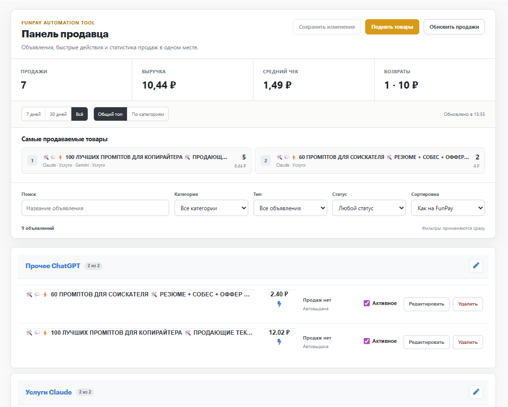
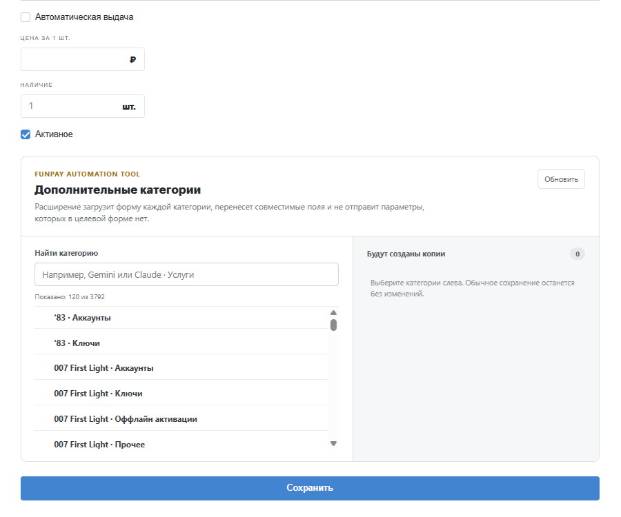
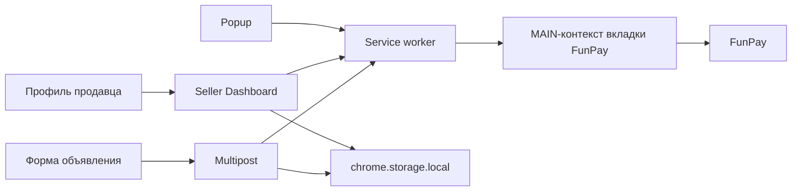

<p align="center">
  
</p>

<h1 align="center">FunPay Automation Tool</h1>

<p align="center">
  Расширение Chrome для управления объявлениями, мультипостинга и автоматизации рутины продавца на FunPay.
</p>

<p align="center">
  
  
  <a href="https://github.com/xailiry/FunPay-Automation-Tool/actions/workflows/ci.yml">
    
  </a>
</p>

> [!IMPORTANT]
> Это независимый проект, не связанный с администрацией FunPay. Расширение работает в текущей браузерной сессии пользователя и зависит от HTML и API площадки.

## Интерфейс

### Панель продавца



### Мультипостинг



## Что умеет

| Возможность | Что делает |
| --- | --- |
| Панель продавца | Перестраивает список объявлений в профиле, добавляет поиск, фильтры, сортировку, быстрый переход к редактированию и удаление с подтверждением. |
| Метрики продаж | Считает продажи, выручку, средний чек, возвраты и самые продаваемые товары за 7, 30 дней или всё время. |
| Управление активностью | Позволяет включать и отключать несколько объявлений, а затем сохранить изменения одной кнопкой. |
| Мультипостинг | Создаёт адаптированные копии объявления в выбранных категориях и не отправляет поля, которых нет в целевой форме. |
| Черновики копий | Даёт отдельно изменить RU/EN-тексты, цену, сообщения покупателю, списки и переключатели каждой будущей копии. |
| Авто-поднятие | Поднимает активные категории вручную или автоматически каждые четыре часа и отличает кулдаун от настоящей ошибки. |
| История операций | Показывает результаты последних поднятий и запусков мультипостинга в popup расширения. |

## Панель продавца в 2.5

Панель появляется только в профиле текущего авторизованного пользователя.

- данные объявлений берутся из реальной страницы профиля;
- статистика загружается со страницы `/orders/trade`;
- успешными считаются статусы `Оплачен` и `Закрыт`, возвраты считаются отдельно;
- продажи сопоставляются по нормализованным названию и категории;
- неактивные объявления сохраняются локально и доступны для повторного включения;
- удалённые объявления удаляются и из локального списка;
- устаревшие неактивные записи автоматически очищаются через 30 дней.

Запросы на изменение объявления всегда начинаются с актуальной формы FunPay. Расширение проверяет `offer_id` и `node_id`, сохраняет остальные поля формы и меняет только требуемое состояние.

## Как работает мультипостинг

Для каждой выбранной категории расширение:

1. Открывает актуальную форму создания объявления в неактивной вкладке.
2. Берёт скрытые поля и значения по умолчанию именно этой категории.
3. Переносит только совместимые поля исходного объявления.
4. Применяет индивидуальные изменения из черновика копии.
5. Публикует копии последовательно и показывает результат каждой операции.

Например, при переносе из `ChatGPT · Прочее` в `Gemini · Услуги` параметры, которых нет в форме услуг, не отправляются. Поля товаров и наличия отображаются в редакторе черновика только при подходящем режиме автовыдачи.

Если создание копии завершилось ошибкой, очередь останавливается, а исходное объявление не сохраняется. Это защищает от незаметной частичной публикации.

## Установка

1. Скачайте или клонируйте репозиторий.
2. Откройте `chrome://extensions`.
3. Включите **Режим разработчика**.
4. Нажмите **Загрузить распакованное расширение**.
5. Выберите папку проекта.

После обновления файлов нажмите кнопку перезагрузки на карточке расширения и обновите вкладки FunPay.

## Безопасность

- логин и пароль не запрашиваются и не сохраняются расширением;
- все действия выполняются в текущей сессии FunPay;
- сетевые запросы ограничены точным списком разрешённых маршрутов;
- запросы принимаются только от вкладок `funpay.com`;
- удаление требует отдельного подтверждения;
- новые файлы изображений не переносятся в копии молча;
- проект не использует удалённый код и не требует runtime-зависимостей.

Автоматизация не гарантирует отсутствие ограничений со стороны площадки. Перед массовой публикацией рекомендуется проверить одну дополнительную категорию.

## Архитектура



Основные границы:

- `background/` — транспорт FunPay, поднятие, парсеры и безопасный шлюз запросов;
- `content/seller-dashboard-*` — данные, локальное хранилище, клиент, DOM-компоненты, View и Controller панели продавца;
- `content/form-adapter.js` — адаптация исходной формы к схеме целевой категории;
- `content/multipost-*` — очередь публикации и интерфейс мультипостинга;
- `popup.*` — настройки авто-поднятия и история операций;
- `tests/` — unit-тесты сервисов, парсеров, адаптации форм и панели продавца.

## Разработка

Требуется Node.js 22 или новее.

```powershell
npm run verify
```

Проверка включает:

- синтаксис всех JavaScript-файлов;
- существование ресурсов из `manifest.json`;
- unit-тесты бизнес-логики и сетевых ограничений.

CI запускает тот же набор проверок для `main` и pull request.

## Ограничения

- совместимость может нарушиться после изменения разметки или форм FunPay;
- метрики строятся по заказам, доступным на странице продаж;
- неактивные объявления восстанавливаются из локального кэша расширения;
- для новых изображений сначала нужно сохранить исходное объявление на FunPay.

История изменений находится в [CHANGELOG.md](./CHANGELOG.md).
