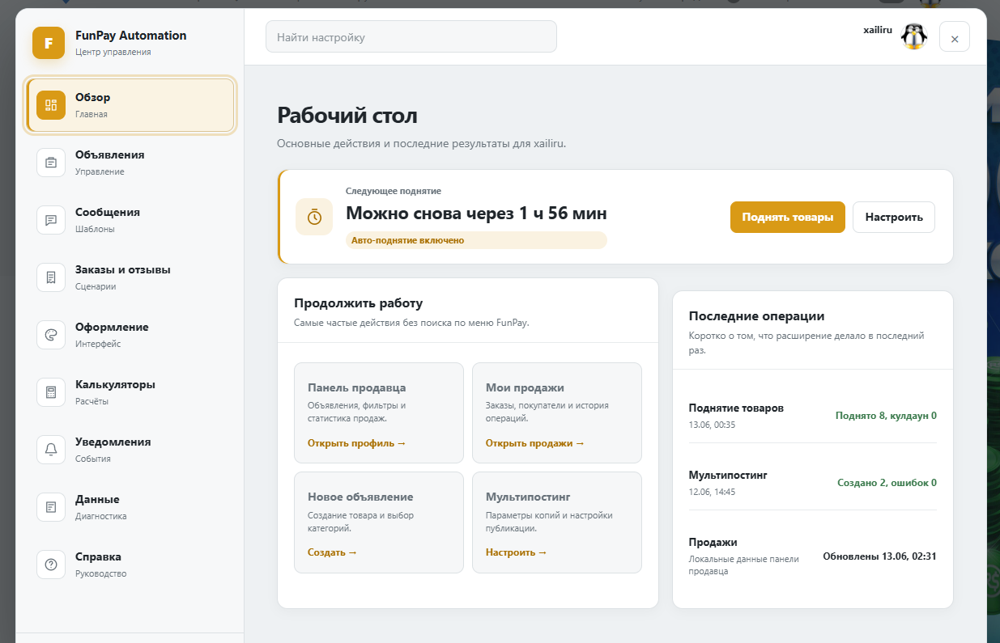
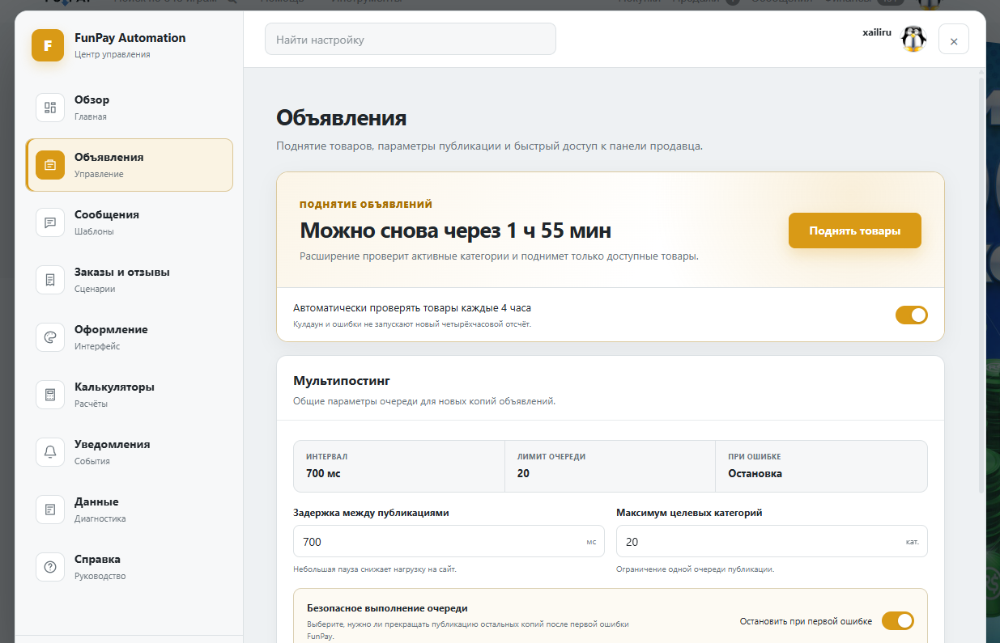
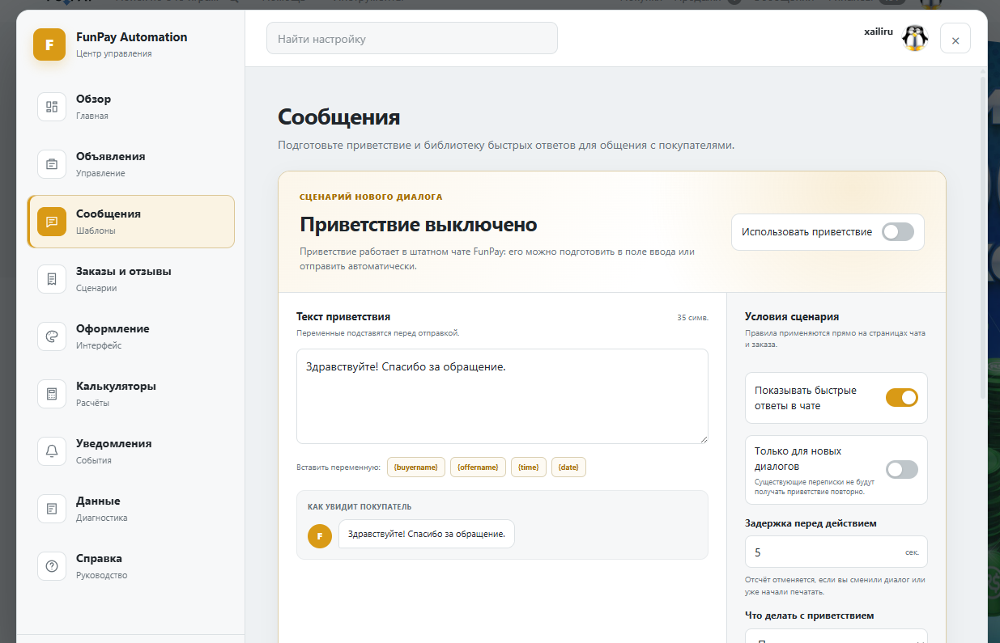
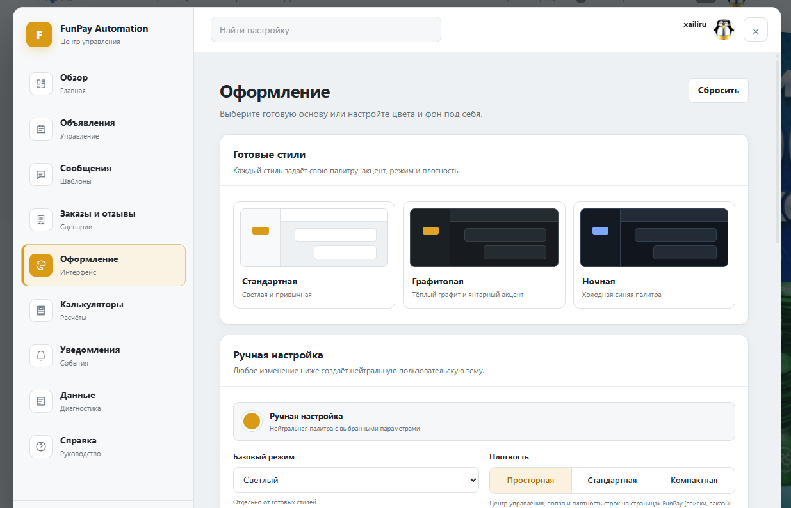
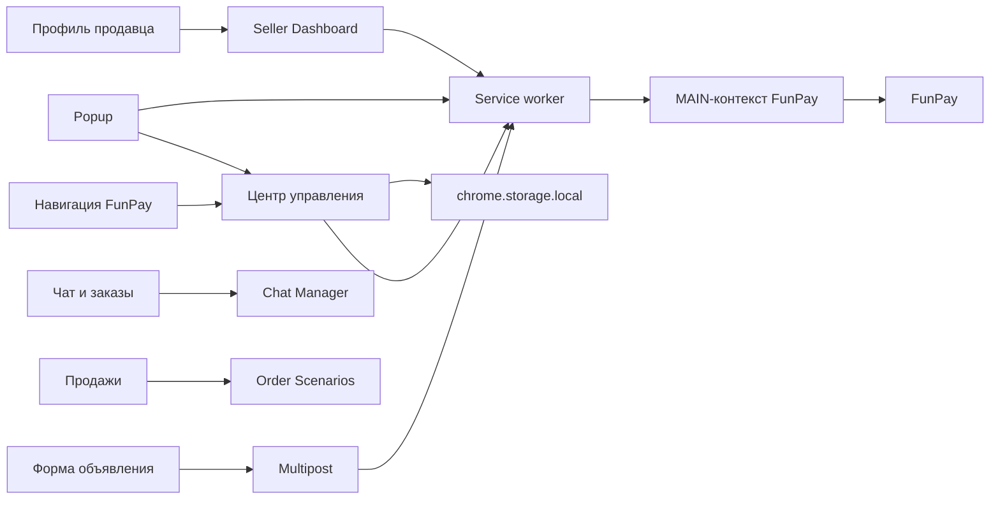

<p align="center">
  
</p>

<h1 align="center">FunPay Automation Tool</h1>

<p align="center">
  Центр управления продавца, встроенный прямо в FunPay.
</p>

<p align="center">
  
  
  <a href="https://github.com/xailiry/FunPay-Automation-Tool/actions/workflows/ci.yml">
    
  </a>
</p>

> [!WARNING]
> Это предварительная версия 3.0. Основные функции работают, но до стабильного выпуска возможны изменения интерфейса и исправления совместимости с отдельными страницами FunPay.

> [!IMPORTANT]
> Проект не связан с администрацией FunPay. Расширение работает в текущей браузерной сессии пользователя и зависит от разметки и внутренних интерфейсов площадки.

## Что изменилось в 3.0

FunPay Automation больше не является набором разрозненных кнопок. Версия 3.0 объединяет инструменты продавца в одном интерфейсе:

- центр управления поверх любой страницы FunPay;
- улучшенное ручное и автоматическое поднятие объявлений;
- мультипостинг с пресетами и отдельными черновиками будущих копий;
- чат-менеджер, быстрые ответы и сценарии сообщений;
- панель продавца с метриками, фильтрами и управлением объявлениями;
- глобальное оформление FunPay с темами и пользовательским фоном;
- калькуляторы комиссий и цены для покупателя;
- экспорт настроек, диагностика и встроенная справка.

## Интерфейс

### Рабочий стол



### Объявления



### Сообщения



### Оформление



### Панель продавца


### Мультипостинг


## Возможности

| Раздел | Возможности |
| --- | --- |
| Центр управления | Открывается через `Инструменты` в навигации FunPay или из popup расширения. |
| Объявления | Ручное и автоматическое поднятие, таймер доступности, история результата и настройки мультипостинга. |
| Мультипостинг | Создаёт адаптированные копии в нескольких категориях и не отправляет отсутствующие в целевой форме поля. |
| Пресеты публикации | Сохраняет наборы категорий, позволяет искать их и быстро загружать в новую публикацию. |
| Черновики копий | Позволяет отдельно изменить тексты, цену, сообщение покупателю и параметры каждой будущей копии. |
| Цена покупателя | Определяет комиссию категории и рассчитывает цену продавца по желаемой сумме для покупателя. |
| Панель продавца | Добавляет метрики, поиск, фильтры, сортировку, статусы, редактирование и удаление объявлений. |
| Сообщения | Хранит шаблоны и закреплённые ответы, подставляет данные покупателя и товара в штатный чат FunPay. |
| Сценарии | Подготавливает или отправляет приветствие, сообщение после оплаты и просьбу оставить отзыв. |
| Оформление | Применяет стандартную, графитовую или ночную тему, акцент, плотность и пользовательский фон. |
| Калькуляторы | Считает комиссии вывода, требуемую сумму и простые валютные преобразования локально. |
| Данные | Экспортирует и импортирует настройки, очищает кэши и показывает состояние расширения. |

## Центр управления

Кнопка **Инструменты** добавляется в верхнюю навигацию FunPay. Интерфейс изолирован от стилей сайта с помощью Shadow DOM и состоит из девяти разделов:

1. **Обзор** - ближайшее поднятие, быстрые действия и последние операции.
2. **Объявления** - поднятие товаров, мультипостинг и пресеты публикации.
3. **Сообщения** - приветствие, шаблоны и быстрые ответы.
4. **Заказы и отзывы** - сценарии после оплаты и закрытия заказа.
5. **Оформление** - темы, цвета, плотность и фон страниц.
6. **Калькуляторы** - комиссии вывода и расчёт желаемой суммы.
7. **Уведомления** - параметры событий, звука и тихих часов.
8. **Данные** - диагностика, импорт, экспорт и очистка кэшей.
9. **Справка** - руководство для обычного пользователя.

Настройки хранятся локально в `chrome.storage.local` и мигрируют через версионированную схему.

## Авто-поднятие

Расширение находит активные категории продавца и проверяет, какие из них FunPay разрешает поднять.

- ручное поднятие доступно из popup, панели продавца и центра управления;
- автоматический режим использует `chrome.alarms`;
- расписание сохраняется после закрытия Chrome;
- после возвращения браузера выполняется не более одного пропущенного запуска;
- новый четырёхчасовой отсчёт начинается только после успешного поднятия;
- кулдаун и критическая ошибка не обнуляют корректный таймер;
- параллельные запуски одной операции блокируются.

## Мультипостинг

Для каждой выбранной категории расширение:

1. Загружает актуальную форму этой категории.
2. Берёт её скрытые поля и значения по умолчанию.
3. Переносит только совместимые данные исходного объявления.
4. Применяет индивидуальные изменения из черновика копии.
5. Последовательно публикует копии и показывает результат операции.

Например, при переносе из `ChatGPT · Прочее` в `Gemini · Услуги` поля, которых нет в форме услуг, не отправляются. Товары и наличие отображаются только при совместимом режиме автовыдачи.

Если публикация копии завершается ошибкой и включена остановка очереди, исходное объявление не сохраняется. Это защищает от незаметной частичной публикации.

## Сообщения и сценарии

Чат-менеджер работает поверх штатной формы FunPay:

- вставляет или отправляет выбранный шаблон;
- поддерживает закреплённые быстрые ответы;
- подставляет имя покупателя, товар, дату и время;
- не перезаписывает уже набранный пользователем текст;
- запоминает обработанные приветствия локально;
- ограничивает количество повторных попыток сценариев;
- защищён от одновременной отправки из нескольких вкладок.

Автоматические действия выключены по умолчанию и включаются пользователем отдельно.

## Панель продавца

Панель появляется только в профиле текущего авторизованного пользователя.

- данные объявлений читаются с реальной страницы профиля;
- статистика загружается со страницы `/orders/trade`;
- продажи, выручка, средний чек и возвраты считаются за 7, 30 дней или всё время;
- показывается оценка суммы после комиссии вывода;
- объявления можно искать, фильтровать, сортировать и включать группой;
- удаление использует актуальную форму редактора FunPay и требует подтверждения;
- неактивные объявления временно сохраняются локально и очищаются через 30 дней.

## Установка

1. Скачайте исходный код или клонируйте репозиторий.
2. Откройте `chrome://extensions`.
3. Включите **Режим разработчика**.
4. Нажмите **Загрузить распакованное расширение**.
5. Выберите папку проекта.
6. Авторизуйтесь на FunPay и обновите открытую вкладку.

После обновления файлов нажмите кнопку перезагрузки на карточке расширения и обновите страницы FunPay.

## Данные и безопасность

- логин, пароль и cookies не запрашиваются и не сохраняются расширением;
- действия выполняются от имени текущей сессии FunPay;
- запросы ограничены доменом FunPay и списком разрешённых маршрутов;
- CSRF-токены и данные аккаунта не записываются в журналы;
- настройки и шаблоны хранятся локально;
- проект не содержит телеметрии и не отправляет данные на сторонние серверы;
- импорт настроек проверяется и ограничен по размеру;
- проект не загружает удалённый исполняемый код и не имеет runtime-зависимостей.

Если пользователь самостоятельно указывает внешний URL фонового изображения, браузер обращается к этому адресу для загрузки файла.

Автоматизация не гарантирует отсутствие ограничений со стороны площадки. Перед массовой публикацией рекомендуется проверить одну дополнительную категорию.

## Архитектура



Основные модули:

- `background/` - транспорт FunPay, расписание поднятия, парсеры и шлюз запросов;
- `toolbar/` - Shadow DOM, разделы, темы, хранилище и адаптеры центра управления;
- `content/multipost-*` - интерфейс и очередь мультипостинга;
- `content/form-adapter.js` - перенос данных между разными схемами форм;
- `content/seller-dashboard-*` - панель продавца по схеме Data/Store/Client/View/Controller;
- `content/chat-manager-*` - контекст чата, шаблоны, хранилище и контроллер;
- `content/order-scenarios-*` - обработка статусов заказов и сценариев сообщений;
- `content/buyer-price-*` - определение комиссии и расчёт цены;
- `tests/` - unit-тесты бизнес-логики, парсеров и сетевых ограничений.

## Разработка

Требуется Node.js 22 или новее.

```powershell
npm run verify
```

Проверка включает:

- синтаксис всех JavaScript-файлов;
- корректность `manifest.json` и наличие подключённых ресурсов;
- unit-тесты бизнес-логики и сетевых границ.

CI запускает тот же набор проверок для `main` и pull request.

## Ограничения Preview

- изменение HTML или внутренних форм FunPay может потребовать обновления адаптеров;
- уведомления зависят от доступности событий в открытой браузерной сессии;
- метрики строятся по заказам, доступным на странице продаж;
- изображения исходного объявления нельзя автоматически перенести как новый файл без предварительного сохранения на FunPay;
- перед стабильной 3.0 планируются дополнительные ручные проверки и исправления интерфейса.

Подробная история выпуска находится в [CHANGELOG.md](./CHANGELOG.md).
